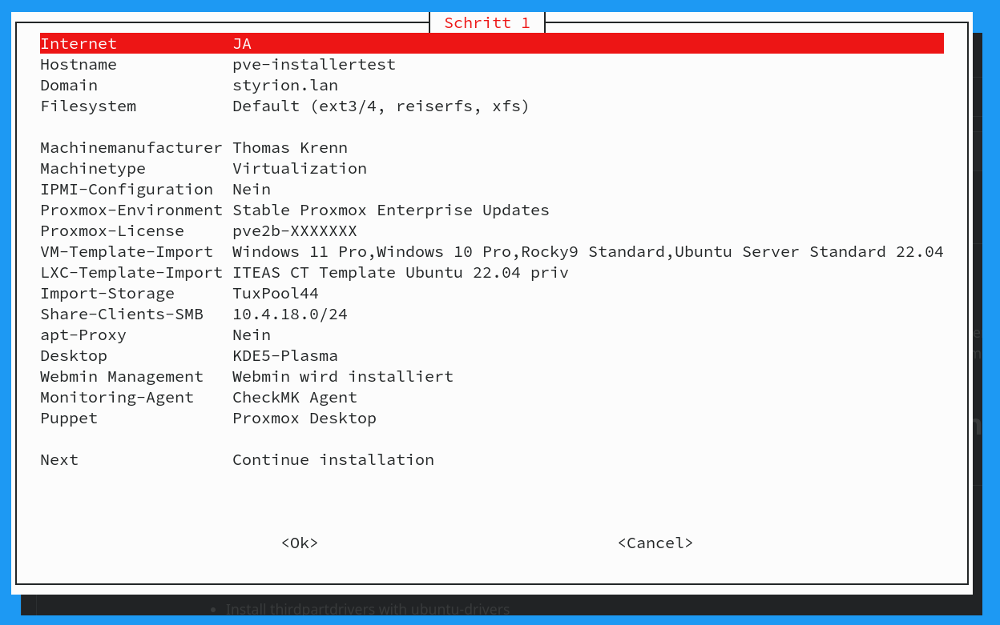
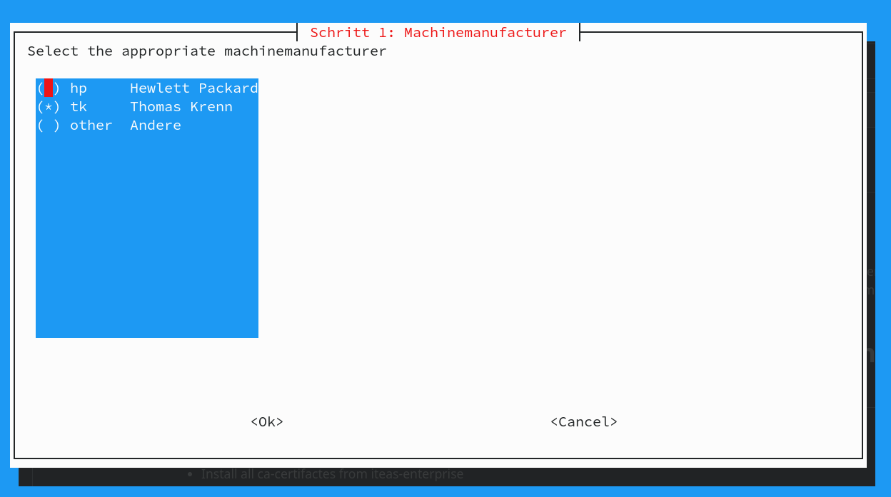
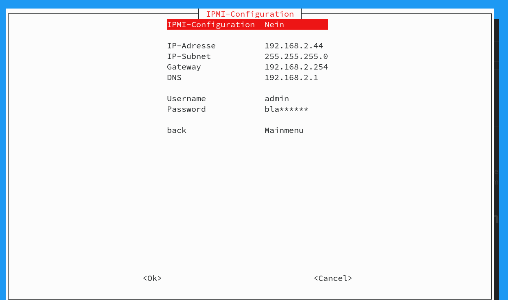
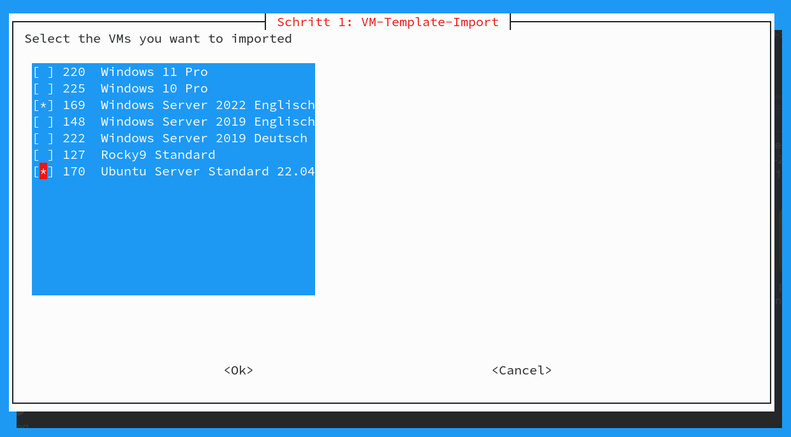

ITEAS Proxmox Installer
=======================
The installer can be used after a basic Proxmox installation and includes features like HP or IPMI tools, Puppet, Webmin, template import and much more.

 

## Features

### Selectable Machinemanufacturer
This will install the tools of the selected manufacturer.
- generic
- HP
- Thomas Krenn

### Choose an machinetype
You can choose here "Virtualization (Default)", or "backup". What does the program for you if you choose "backup"?

If you choose "backup", the local storage is converted to a filesystem that can be used for backup. LVM/LVM-Thin are deleted and a separate dataset is created if you use ZFS. Furthermore, Samba is installed and a share that you can customize is created. Additionally we recommend to select Webmin. This allows you to manage Samba shares and many other options via another web interface. 

### IPMI pre-configuration
IPMI Configuration of Thomas Krenn Servers (Supermicro)

### Selectable Proxmox including Update and Subscription
- stable (Enterprise repo)
- test (nosubscription repo)
- noupdate
- Enter your subscription directly in the installer

### VM and LXC Template Import
You have the possibility to import ready-made templates with the installer. The templates defined in the program are only accessible by ITEAS IT Services GmbH. To use your own templates, add your share and the ID's of the templates in the script. This will allow you to automatically roll out templates to new servers. A target storgage where templates are to be imported must be selected. 

~~~
self.VM_IMPORTS = {
            "220": {"name": "Windows 11 Pro", "template": True},
            
        }
        self.LXC_IMPORTS = {
            "143": {"name": "ITEAS CT Template Ubuntu 22.04 priv", "template": True },

~~~
and
~~~
# Global variables
VERSION = "1.2.7"
TITLE = "iteas Proxmox Installer " + VERSION
CHECK_INTERNET_IP = "77.235.68.35"
VM_TEMPLATE_CIFS_SHARE = "//10.255.18.3/proxmox-install"
VM_TEMPLATE_CIFS_USER = "localbackup02"
SMB_ADMIN_PASSWD = "backmode123"
~~~

### Other features

- SMB Client Security
- Webmin Management selectable
- Puppet/Foreman autointegration
- selectable Monitoringagent (checkMK)
- performance optimizations (Systemd and force unmount)
- APC UPS Client with ready USB configuration
- ZSH Shell https://github.com/boospy/ZSH-und-BASH-Configs
- Nanoconfig
- Speicherpig
- Plasma Desktop
- Plasma Desktop (plasma-light) -> only base packages for the plasma desktop
- Plasma Desktop (plasma-light-win) -> build as windows workstation with spice)

## How to use?
Download the Script for PVE8 on your Proxmoxserver, make it executable and use it. 
~~~
wget https://raw.githubusercontent.com/ITEAS-IT-Services/iteas-proxmox-installer/main/proxmox_install_PVE8.py
chmod +x proxmox_install_PVE8.py
./proxmox_install_PVE8.py
~~~
Follow the screen. 
After installation the postfix configuration "main.cf" is changed for useing ITEAS/Styrion's mailservice. To change this edit the file "/etc/postfix/main.cf" with your favourite editor and change the lines as you like:

~~~
...
myhostname=xxx.monitoring.iteas.at
relayhost = smtp.styrion.net
...
~~~

### If you have an Desktop installed...

... a new user named "pveadm" was created. To be able to log in, please change the password of this user with the root-shell (ssh) to one you would like to use.
~~~
passwd pveadm
~~~

Have Fun! :)
~~~

  
                 (__) 
                 (oo) 
           /------\/ 
          / |    ||   
         *  /\---/\ 
            ~~   ~~   
..."Have you mooed today?"...
~~~
For professional support, please feel free to contact us also by email. support@iteas.at
